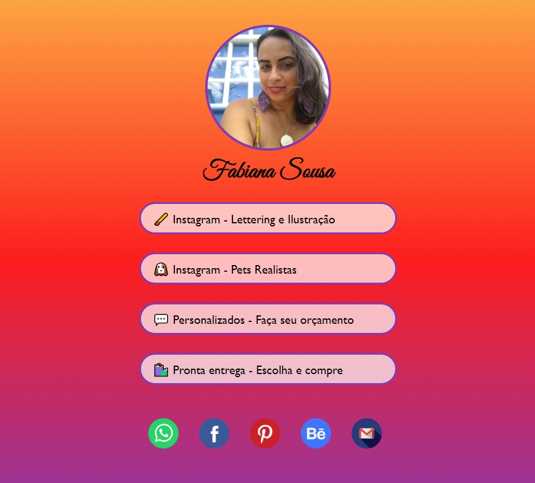

<h1 align="center">
    
</h1>

  :white_check_mark: <a href="https://andreadcsousa.github.io/projeto_social-tree/" target="_blank">Veja a página</a>&nbsp;&nbsp;&nbsp;|&nbsp;&nbsp;&nbsp;
  :white_check_mark: <a href="https://rocketseat.com.br/" target="_blank">Conheça a Rocketseat</a>

# :computer: Projeto
 
- Idealizador: Rocketseat
- Projeto: Desafio Social Tree
- Lado da força: Front-End
- Tipo: Projeto Experimental
- Etapa: Criação

# :rocket: Tecnologias

Esse projeto foi desenvolvido com:

# :iphone: Layout

